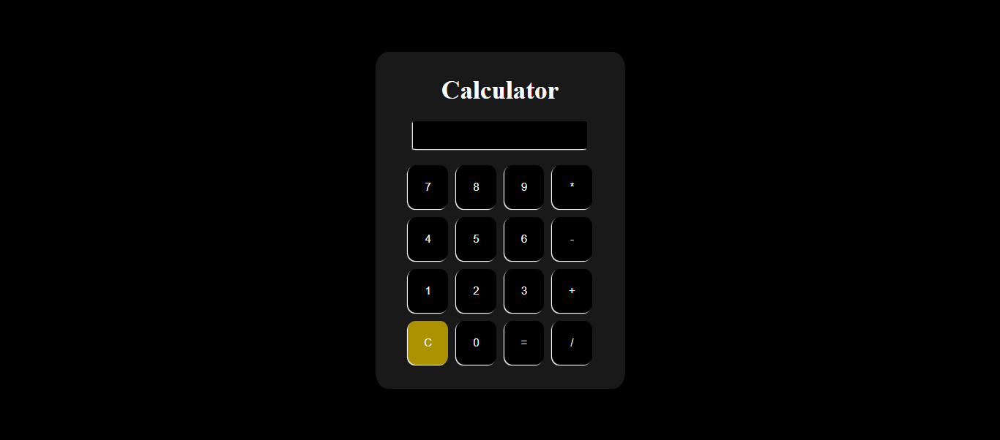

# Calculator Project



A simple web-based calculator using **HTML, CSS, and JavaScript**. It supports both keyboard and mouse input, basic arithmetic operations, clear and backspace functions, and handles division by zero. The calculation history is stored in **localStorage**.

## Live demo
- https://simple-calculator-gamma-eight.vercel.app/

## Features
- Supports **keyboard and mouse input**
- Basic arithmetic operations (`+`, `-`, `*`, `/`)
- **Clear (`C`)** and **Backspace** functionality
- **Division by zero handling**
- Calculation history stored in **localStorage**

## Installation
```sh
https://github.com/Ayman-Elfeky/Simple-Calculator.git
```

Open `index.html` in your browser.

## Usage
- Click buttons or use the keyboard to enter numbers and operators.
- Press `Enter` or `=` to calculate.
- Use `C` to clear input and `Backspace` to delete the last digit.

